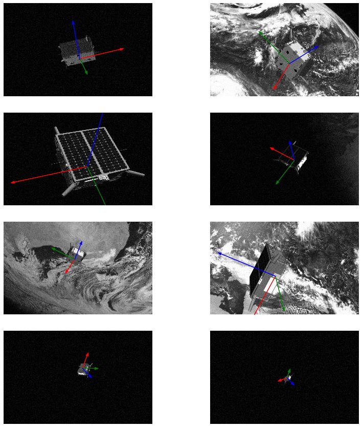
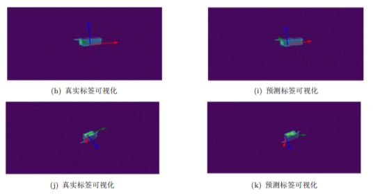

#### 项目简介

数据集和任务都来自于欧空局主办的竞赛[Pose Estimation Challenge](https://kelvins.esa.int/satellite-pose-estimation-challenge/home/)

任务是用单目相机拍摄的卫星探测器图像来估计探测器姿态。

<dr/>

#### 单目姿态估计方法

单目姿态估计有`基于学习`和`基于模型`两种方法。

- 基于学习的方法

  > 基于学习的方法借助于机器学习 (machine learning) 方法，通常从事先获取的不同姿态下的训练样本中学 习二维观测（单目相机所摄图像）与三维姿态之间的对应关系，并将学习得到的决策规则或回归函数应用于样本，所得结果作为对 样本的姿态估计。基于学习的方法一般采用全局观测特征，不需检测或识别物体的局部特征，具有较好的鲁棒 性。 

- 基于模型的方法

  >基于模型的方法通常利用物体的几何关系或者物体的特征点来估计。其基本思想是利用某种几何模型或结构来表示物体的结构和形状（也就是说需要先建立物体的模型），并通过提取某些物体特征，在模型和图像之间建立起对应关系，然后通过几 何或者其它方法实现物体空间姿态的估计。

 

#### 文件说明

1. 使用随机森林对q，r直接回归的代码在random_forest.py里，可直接运行
2. 使用随机森林对关键点进行回归的代码在RF_regressPoint.py里，可直接运行
3. utils.py中存放一些辅助函数

 

#### 结果演示

Ground True

 

预测结果

